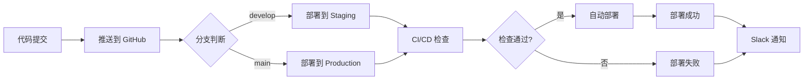

> ***YanYuCloudCube***
> 言启象限 | 语枢未来
> ***Words Initiate Quadrants, Language Serves as Core for the Future***
> 万象归元于云枢 | 深栈智启新纪元
> ***All things converge in the cloud pivot; Deep stacks ignite a new era of intelligence***

---

# YYC³ Customer Care Center - 部署方案文档

## 📋 概述

YYC³ Customer Care Center 项目采用 Vercel 作为主要部署平台，支持自动化部署、多环境管理和全球 CDN 加速。

## 🎯 核心内容

### 1. 背景与目标

#### 1.1 项目背景

YYC³ Customer Care Center 项目是一个基于「五高五标五化」理念的现代化 AI 代理服务落地页，采用 Next.js 15.0.3 + React 19 构建，集成了国际化系统、3D 场景交互、动画效果和响应式设计。

#### 1.2 文档目标

- 规范部署方案相关的业务标准与技术落地要求
- 为项目相关人员提供清晰的参考依据
- 保障相关模块开发、实施、运维的一致性与规范性

### 2. 设计原则

#### 2.1 五高原则

- **高可用性**：确保系统 7x24 小时稳定运行
- **高性能**：优化加载速度和交互响应
- **高安全性**：保护用户数据和隐私安全
- **高扩展性**：支持业务快速扩展
- **高可维护性**：便于后续维护和升级

#### 2.2 五标体系

- **标准化**：统一的部署流程和配置标准
- **规范化**：严格的部署规范和审批流程
- **自动化**：提高部署效率和质量
- **智能化**：利用自动化工具提升能力
- **可视化**：直观的部署状态和监控界面

#### 2.3 五化架构

- **流程化**：标准化的部署流程
- **文档化**：完善的部署文档体系
- **工具化**：高效的部署工具链
- **数字化**：数据驱动的部署决策
- **生态化**：开放的部署生态系统

### 3. 部署架构

#### 3.1 整体架构

```
┌─────────────────────────────────────────────────────────┐
│                   开发环境                      │
│                                                 │
│  ┌────────────────────────────────────────────┐    │
│  │      本地开发环境              │    │
│  │  - Next.js Dev Server (端口 3200)       │    │
│  │  - 热重载和快速刷新                     │    │
│  │  - 开发工具和调试器                     │    │
│  └────────────┬───────────────────────┘    │
└───────────────┼────────────────────────────┘
                │ Git Push
                ▼
┌─────────────────────────────────────────────────────────┐
│                  GitHub 仓库                     │
│                                                 │
│  ┌────────────────────────────────────────────┐    │
│  │   GitHub Actions CI/CD 工作流      │    │
│  │  - 自动化测试                           │    │
│  │  - 代码检查                             │    │
│  │  - 自动部署                             │    │
│  └────────────┬───────────────────────┘    │
└───────────────┼────────────────────────────┘
                │
                ▼
┌─────────────────────────────────────────────────────────┐
│                  Vercel 平台                     │
│                                                 │
│  ┌──────────────────┬────────────────────┐    │
│  │  Staging 环境  │  Production 环境 │    │
│  │                 │                    │    │
│  │  - 预发布测试   │  - 生产环境        │    │
│  │  - 功能验证     │  - 正式上线        │    │
│  │  - 性能测试     │  - 用户访问        │    │
│  └──────────────────┴────────────────────┘    │
│                                                 │
│  ┌────────────────────────────────────────────┐    │
│  │         Vercel Edge Network        │    │
│  │  - 全球 CDN 节点                       │    │
│  │  - 自动缩放                             │    │
│  │  - 边缘计算                             │    │
│  └────────────────────────────────────────────┘    │
└─────────────────────────────────────────────────┘
```

#### 3.2 技术栈

- **前端框架**：Next.js 15.0.3 + React 19
- **部署平台**：Vercel
- **版本控制**：GitHub
- **CI/CD**：GitHub Actions
- **监控服务**：Sentry
- **域名服务**：Vercel DNS
- **CDN**：Vercel Edge Network

### 4. 部署环境

#### 4.1 环境分类

**开发环境（Development）**：
- 用途：本地开发和测试
- 访问地址：`http://localhost:3200`
- 启动命令：`npm run dev`
- 特点：热重载、快速刷新、详细错误信息

**预发布环境（Staging）**：
- 用途：预发布测试和验证
- 访问地址：`https://yyc3-ccc-staging.vercel.app`
- 部署方式：自动部署（develop 分支）
- 特点：模拟生产环境、功能验证、性能测试

**生产环境（Production）**：
- 用途：正式上线和用户访问
- 访问地址：`https://yyc3-ccc.vercel.app`（或自定义域名）
- 部署方式：自动部署（main 分支）
- 特点：全球 CDN、自动缩放、高可用性

#### 4.2 环境变量配置

**开发环境变量（`.env.development`）**：

```env
# 应用配置
NEXT_PUBLIC_APP_NAME="YYC³ Customer Care Center"
NEXT_PUBLIC_APP_VERSION="1.0.0"
NEXT_PUBLIC_APP_ENV="development"

# API 配置
NEXT_PUBLIC_API_URL="http://localhost:3200/api"
NEXT_PUBLIC_API_TIMEOUT="30000"

# Sentry 配置
NEXT_PUBLIC_SENTRY_DSN=""
SENTRY_DSN=""
SENTRY_ENVIRONMENT="development"
SENTRY_TRACES_SAMPLE_RATE="1.0"
SENTRY_REPLAY_SESSION_SAMPLE_RATE="1.0"
SENTRY_REPLAY_ON_ERROR_SAMPLE_RATE="1.0"

# 功能开关
NEXT_PUBLIC_ENABLE_ANALYTICS="false"
NEXT_PUBLIC_ENABLE_SENTRY="false"
NEXT_PUBLIC_ENABLE_I18N="true"
NEXT_PUBLIC_ENABLE_3D="true"
NEXT_PUBLIC_ENABLE_ANIMATIONS="true"

# IP 访问控制
NEXT_PUBLIC_ENABLE_IP_ACCESS_CONTROL="false"
ALLOWED_IP_RANGES=""
DENIED_IP_RANGES=""

# 其他配置
NEXT_PUBLIC_DEFAULT_LANGUAGE="zh-CN"
NEXT_PUBLIC_SUPPORTED_LANGUAGES="zh-CN,en-US"
```

**预发布环境变量（`.env.staging`）**：

```env
# 应用配置
NEXT_PUBLIC_APP_NAME="YYC³ Customer Care Center"
NEXT_PUBLIC_APP_VERSION="1.0.0"
NEXT_PUBLIC_APP_ENV="staging"

# API 配置
NEXT_PUBLIC_API_URL="https://yyc3-ccc-staging.vercel.app/api"
NEXT_PUBLIC_API_TIMEOUT="30000"

# Sentry 配置
NEXT_PUBLIC_SENTRY_DSN="https://your-dsn@sentry.io/project-id"
SENTRY_DSN="https://your-dsn@sentry.io/project-id"
SENTRY_ENVIRONMENT="staging"
SENTRY_TRACES_SAMPLE_RATE="0.5"
SENTRY_REPLAY_SESSION_SAMPLE_RATE="0.1"
SENTRY_REPLAY_ON_ERROR_SAMPLE_RATE="1.0"

# 功能开关
NEXT_PUBLIC_ENABLE_ANALYTICS="true"
NEXT_PUBLIC_ENABLE_SENTRY="true"
NEXT_PUBLIC_ENABLE_I18N="true"
NEXT_PUBLIC_ENABLE_3D="true"
NEXT_PUBLIC_ENABLE_ANIMATIONS="true"

# IP 访问控制
NEXT_PUBLIC_ENABLE_IP_ACCESS_CONTROL="true"
ALLOWED_IP_RANGES="0.0.0.0/0"
DENIED_IP_RANGES=""

# 其他配置
NEXT_PUBLIC_DEFAULT_LANGUAGE="zh-CN"
NEXT_PUBLIC_SUPPORTED_LANGUAGES="zh-CN,en-US"
```

**生产环境变量（`.env.production`）**：

```env
# 应用配置
NEXT_PUBLIC_APP_NAME="YYC³ Customer Care Center"
NEXT_PUBLIC_APP_VERSION="1.0.0"
NEXT_PUBLIC_APP_ENV="production"

# API 配置
NEXT_PUBLIC_API_URL="https://yyc3-ccc.vercel.app/api"
NEXT_PUBLIC_API_TIMEOUT="30000"

# Sentry 配置
NEXT_PUBLIC_SENTRY_DSN="https://your-dsn@sentry.io/project-id"
SENTRY_DSN="https://your-dsn@sentry.io/project-id"
SENTRY_ENVIRONMENT="production"
SENTRY_TRACES_SAMPLE_RATE="0.1"
SENTRY_REPLAY_SESSION_SAMPLE_RATE="0.01"
SENTRY_REPLAY_ON_ERROR_SAMPLE_RATE="0.1"

# 功能开关
NEXT_PUBLIC_ENABLE_ANALYTICS="true"
NEXT_PUBLIC_ENABLE_SENTRY="true"
NEXT_PUBLIC_ENABLE_I18N="true"
NEXT_PUBLIC_ENABLE_3D="true"
NEXT_PUBLIC_ENABLE_ANIMATIONS="true"

# IP 访问控制
NEXT_PUBLIC_ENABLE_IP_ACCESS_CONTROL="true"
ALLOWED_IP_RANGES="0.0.0.0/0"
DENIED_IP_RANGES=""

# 其他配置
NEXT_PUBLIC_DEFAULT_LANGUAGE="zh-CN"
NEXT_PUBLIC_SUPPORTED_LANGUAGES="zh-CN,en-US"
```

### 5. 部署流程

#### 5.1 首次部署

**步骤 1：连接 GitHub 仓库**

1. 访问 [Vercel 控制台](https://vercel.com/dashboard)
2. 点击 "Add New Project"
3. 选择 "Import Git Repository"
4. 授权 Vercel 访问 GitHub 仓库
5. 选择 `yyc3-customer-care-center` 仓库

**步骤 2：配置项目设置**

1. **项目名称**：`yyc3-customer-care-center`
2. **框架预设**：Next.js
3. **根目录**：`./`
4. **构建命令**：`npm run build`
5. **输出目录**：`.next`
6. **安装命令**：`npm ci`

**步骤 3：配置环境变量**

1. 在项目设置中添加环境变量
2. 按照环境分类配置变量
3. 确保敏感信息使用 Secrets

**步骤 4：部署项目**

1. 点击 "Deploy" 按钮
2. 等待构建和部署完成
3. 验证部署成功

#### 5.2 日常部署

**自动部署流程**：



**手动部署流程**：

1. 访问 Vercel 控制台
2. 选择项目
3. 点击 "Deployments"
4. 点击 "..." 菜单
5. 选择 "Redeploy"
6. 选择要重新部署的提交
7. 点击 "Redeploy" 按钮

### 6. 域名配置

#### 6.1 添加自定义域名

**步骤 1：添加域名**

1. 访问 Vercel 控制台
2. 选择项目
3. 点击 "Settings"
4. 点击 "Domains"
5. 输入自定义域名（如：`yyc3.cube.com`）
6. 点击 "Add" 按钮

**步骤 2：配置 DNS**

1. 根据域名提供商选择配置方式
2. 添加 CNAME 记录或 A 记录
3. 等待 DNS 生效（通常需要 24-48 小时）

**步骤 3：验证域名**

1. 等待 SSL 证书自动生成
2. 验证域名可以正常访问
3. 检查 HTTPS 是否正常工作

#### 6.2 域名配置示例

**使用 Vercel DNS**：

```
类型: CNAME
名称: www
值: cname.vercel-dns.com
TTL: 3600
```

**使用其他 DNS 提供商**：

```
类型: CNAME
名称: www
值: yyc3-customer-care-center.vercel.app
TTL: 3600
```

### 7. 构建优化

#### 7.1 构建配置

**next.config.mjs 配置**：

```javascript
/** @type {import('next').NextConfig} */
const nextConfig = {
  reactStrictMode: true,
  swcMinify: true,
  compress: true,
  poweredByHeader: false,
  
  images: {
    domains: ['yyc3.cube.com'],
    formats: ['image/avif', 'image/webp'],
    deviceSizes: [640, 750, 828, 1080, 1200, 1920, 2048, 3840],
    imageSizes: [16, 32, 48, 64, 96, 128, 256, 384],
  },
  
  experimental: {
    optimizePackageImports: ['@radix-ui/react-icons'],
  },
  
  compiler: {
    removeConsole: process.env.NODE_ENV === 'production',
  },
  
  typescript: {
    ignoreBuildErrors: false,
  },
  
  eslint: {
    ignoreDuringBuilds: false,
  },
};

export default nextConfig;
```

#### 7.2 性能优化

**静态资源优化**：

- 使用 WebP 和 AVIF 格式图片
- 启用 Gzip 和 Brotli 压缩
- 使用 CDN 加速静态资源
- 实现代码分割和懒加载

**代码优化**：

- 使用 Tree Shaking 减少包体积
- 启用 SWC 编译器
- 优化依赖包大小
- 使用动态导入

**缓存策略**：

- 配置合适的缓存头
- 使用 Service Worker 缓存
- 实现浏览器缓存
- 使用 Vercel Edge Cache

### 8. 监控和日志

#### 8.1 部署监控

**Vercel 控制台**：

- 查看部署历史
- 监控部署状态
- 查看构建日志
- 分析性能指标

**Sentry 监控**：

- 错误追踪
- 性能监控
- 用户会话重放
- 告警通知

#### 8.2 日志管理

**访问日志**：

- 记录用户访问信息
- 分析用户行为
- 监控流量趋势
- 发现异常访问

**错误日志**：

- 记录错误信息
- 分析错误原因
- 追踪错误来源
- 优化错误处理

**性能日志**：

- 记录页面加载时间
- 分析性能瓶颈
- 优化加载速度
- 提升用户体验

### 9. 安全配置

#### 9.1 HTTPS 配置

- 自动配置 SSL/TLS 证书
- 强制使用 HTTPS
- 配置 HSTS 头
- 定期更新证书

#### 9.2 安全头配置

```javascript
// next.config.mjs
const nextConfig = {
  async headers() {
    return [
      {
        source: '/:path*',
        headers: [
          {
            key: 'X-DNS-Prefetch-Control',
            value: 'on'
          },
          {
            key: 'Strict-Transport-Security',
            value: 'max-age=63072000; includeSubDomains; preload'
          },
          {
            key: 'X-Frame-Options',
            value: 'SAMEORIGIN'
          },
          {
            key: 'X-Content-Type-Options',
            value: 'nosniff'
          },
          {
            key: 'X-XSS-Protection',
            value: '1; mode=block'
          },
          {
            key: 'Referrer-Policy',
            value: 'origin-when-cross-origin'
          },
          {
            key: 'Content-Security-Policy',
            value: "default-src 'self'; script-src 'self' 'unsafe-eval' 'unsafe-inline'; style-src 'self' 'unsafe-inline'; img-src 'self' data: https:; font-src 'self' data:; connect-src 'self' https:;"
          }
        ]
      }
    ]
  }
};
```

#### 9.3 IP 访问控制

- 配置允许的 IP 范围
- 配置拒绝的 IP 范围
- 实现白名单机制
- 实现黑名单机制

详见 [YYC3-CCC-IP访问控制指南.md](../YYC3-CCC-IP访问控制指南.md)。

### 10. 备份和恢复

#### 10.1 数据备份

- 定期备份数据库
- 备份配置文件
- 备份环境变量
- 备份用户数据

#### 10.2 灾难恢复

- 制定恢复计划
- 定期演练恢复流程
- 确保备份可用性
- 最小化恢复时间

### 11. 故障排查

#### 11.1 常见问题

**问题：部署失败**

- 检查构建日志
- 验证依赖项版本
- 检查环境变量配置
- 查看错误信息

**问题：页面加载缓慢**

- 检查网络连接
- 优化图片资源
- 启用 CDN 加速
- 检查代码性能

**问题：功能异常**

- 检查环境变量
- 查看错误日志
- 验证 API 连接
- 检查权限配置

#### 11.2 调试技巧

- 使用 Vercel CLI 本地测试
- 查看 Sentry 错误追踪
- 使用浏览器开发者工具
- 检查网络请求

### 12. 相关文档

- [YYC3-CCC-安装指南.md](../YYC3-CCC-安装指南.md) - 安装和配置指南
- [YYC3-CCC-CICD-GUIDE.md](../YYC3-CCC-CICD-GUIDE.md) - CI/CD 配置指南
- [YYC3-CCC-部署运维-环境配置文档.md](./092-YYC3-CCC-部署运维-环境配置文档.md) - 环境配置指南
- [YYC3-CCC-部署运维-监控告警文档.md](./093-YYC3-CCC-部署运维-监控告警文档.md) - 监控告警配置
- [YYC3-CCC-部署运维-故障处理文档.md](./098-YYC3-CCC-部署运维-故障处理文档.md) - 故障处理流程

---

<div align="center">

> 「***YanYuCloudCube***」
> 「***<admin@0379.email>***」
> 「***Words Initiate Quadrants, Language Serves as Core for the Future***」
> 「***All things converge in the cloud pivot; Deep stacks ignite a new era of intelligence***」
</div>
